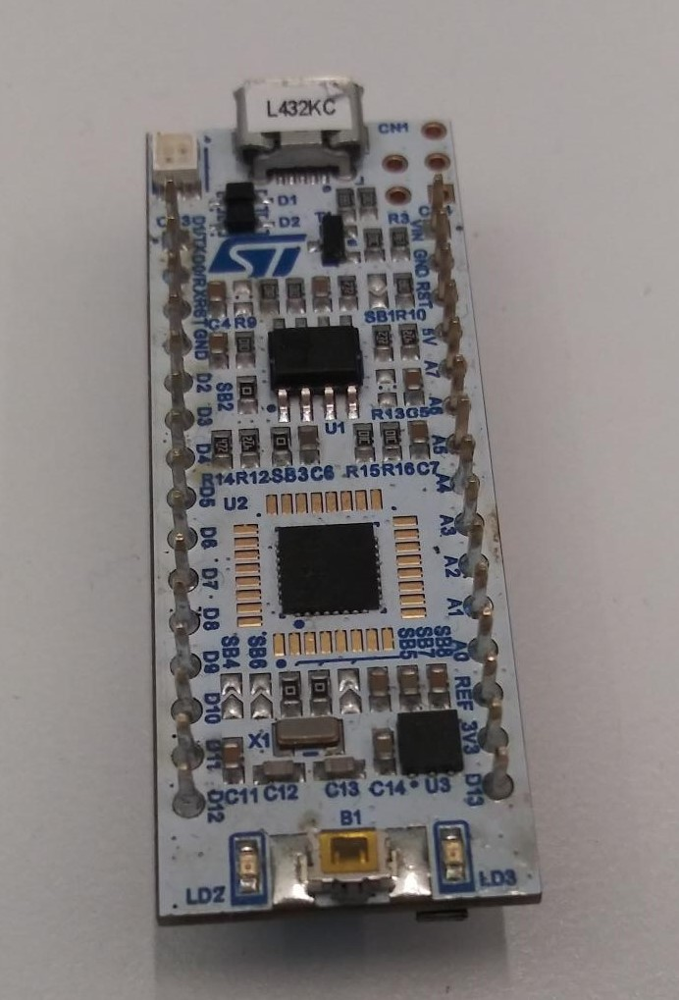
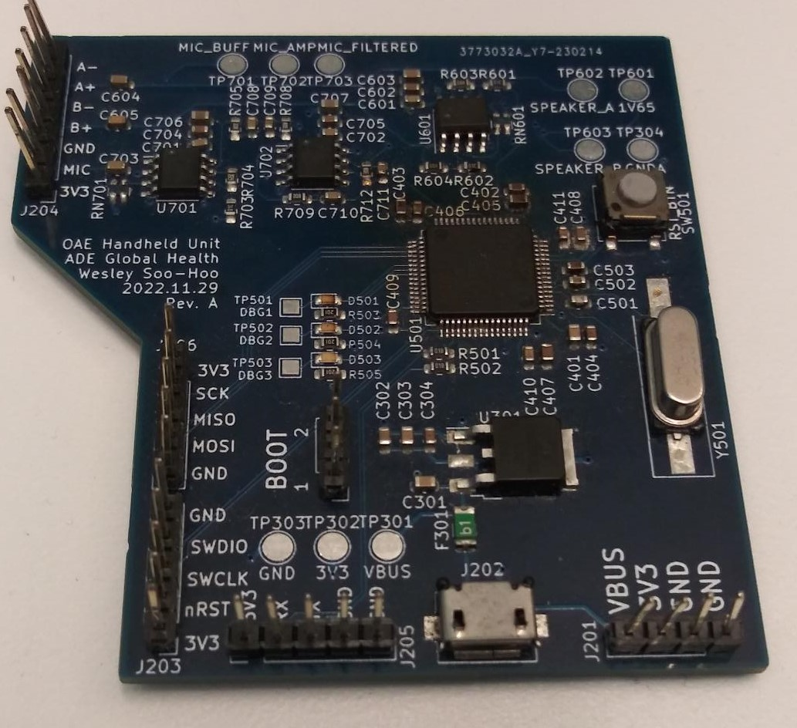
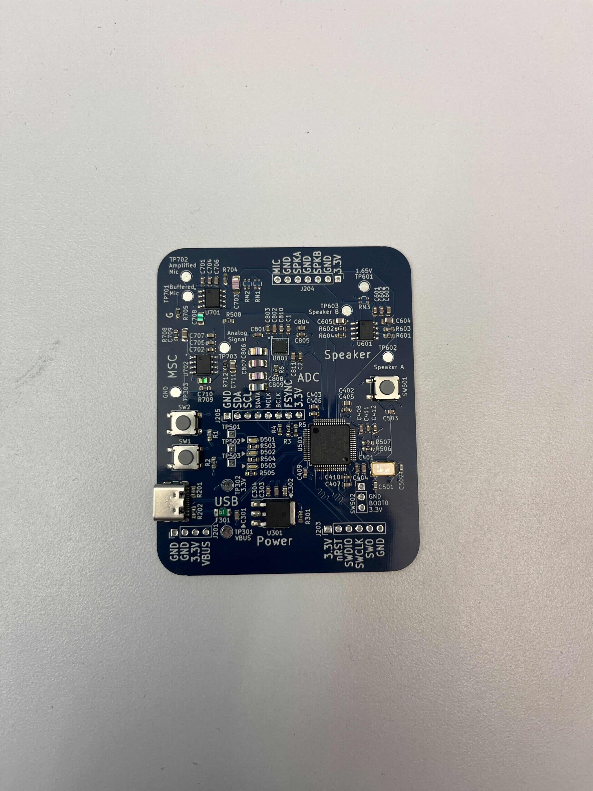
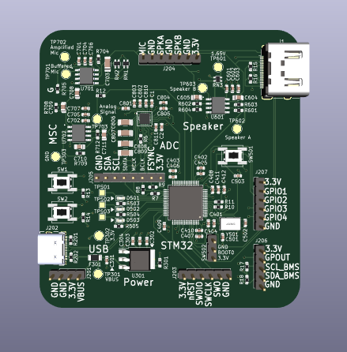

# OAE Firmware

## About
This repository contains the firmware needed for flashing our boards.

We have tested our configurations using STM32CubeIDE v1.13.0.

A full setup guide is available [here](docs/setup.md) for setting up our toolchain.

Software for the Analog Discovery can be found [here](https://digilent.com/reference/software/waveforms/waveforms-3/start).

## Naming

The folder `docs` contains documentation files not needed to compile the code.

The `common` folder contains the CMSIS-DSP libaray that enables us to do advanced math functions (ex. FFT, matrix math).

We use the following naming scheme for each prototype board in order to avoid tooling issues.

Hardware Board Version | Name | Image | Processor | Notes
---|---|---|---|---
Nucleo L432KC | `NUCLEO-L432KC` || STM32L432KC | Only has 1 DAC, HSE clock jumper enabled
[v1 - Rev. A](https://github.com/ADE-GlobalHealth/oae_hardware/releases/tag/v1.0.0)| `OAE_SwedishFish` |  |STM32L475RC | Microphone signal chain and speaker chain malfunction, undervoltage, exposes UART and SPI as well
[v1.1.2 - Rev. B](https://github.com/ADE-GlobalHealth/oae_hardware/releases/tag/v1.1.2)| `OAE_PopTarts` |  |STM32L475RC | One board has melted USB, but otherwise functions as expected. Header pins also vary.
[v1.2 - Rev. C](https://github.com/ADE-GlobalHealth/oae_hardware/tree/pcb_new)| `OAE_CliffBar` |  |STM32L496RGTx | Only partially assembled.

 For the curious, it is based on the last item purchased from the vending machines. 
