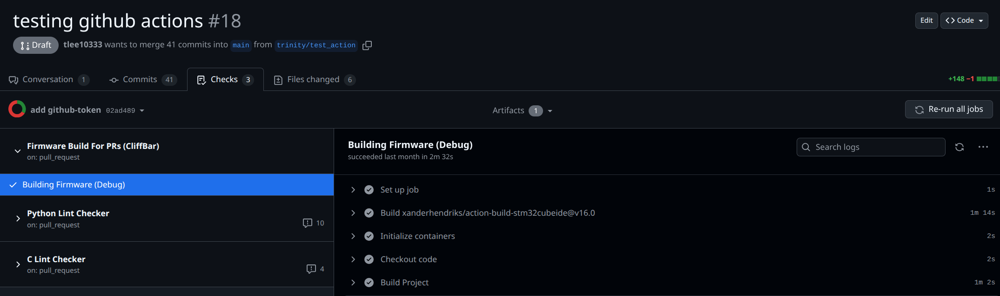
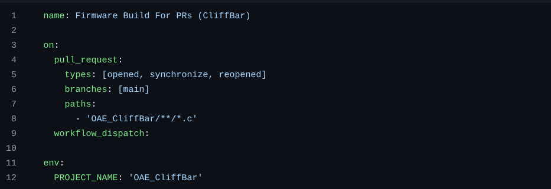

# Github Actions Documentation

This is an informational document on the Github Actions currently present in this
repository. **No user setup needs to be done for these to run.** Currently, these actions
only trigger when a relevant commit is pushed to an open pull request (PR). To see all checks that ran in a PR,
navigate to the "Checks" tab in the PR. Some actions,
like the C and Python Linters, will automatically apply in-line comments to the PR for
any errors. All workflow files for the actions exist in the `.github/workflows` file.

> In depth exploration and documentation can be found in the Fall 2025 Assumption Tests.

## 1. C/C++ Linting — cpp-linter

We use cpp-linter to enforce consistent C coding style and catch
common issues early using `clang-tidy` and `clang-format`. Automatic in-line annotations
for errors will be added to the PR.

## 2. Python Linting — ruff

Any Python utilities, scripts, or tooling in the repository are
checked using ruff, a fast, modern Python linter. Automatic in-line annotations
for errors will be added to the PR.

## 3. Automatic Firmware Builds

Using the STM32CubeIDE, we automatically try building the firmware when C source code for a project is modified.
If successfully built, it will also save and upload build artifacts so that
Below is the list of currently supported firmware versions for automatic build checks:

- OAE_CliffBar

> We currently use an external Github action for automatically building our firmware (<https://github.com/xanderhendriks/action-build-stm32cubeide>) that uses a pre-existing docker image. We did explore making our own leaner Dockerfile for a headless
> build, but we found that the benefit was only having the action be 30 seconds faster. After weighing the benefits we decided
> it was more preferable to use an externally maintained github actions. More technical information on headless builds are found in the assumption test.

### Adding Firmware Builds

For new projects, adding a new workflow will be extremely easily as the currently workflow file uses environment variables,
so as long as the environment variable name and path to the project are updated, you can just copy and paste.

