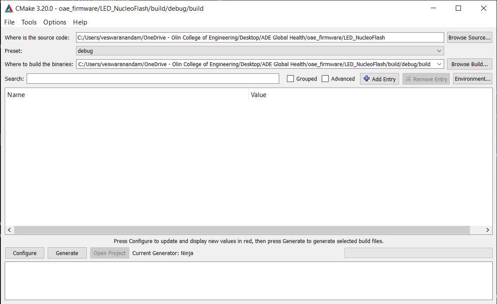
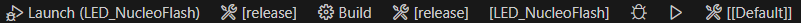
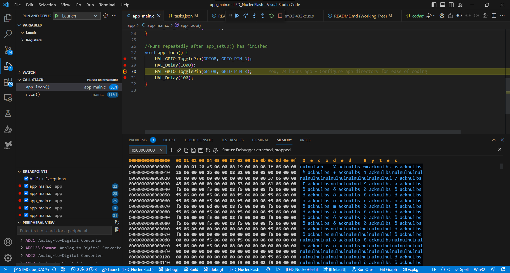

# Setup

Clone this repository in a directory of your choice.

Install [STM32CubeIDE](https://www.st.com/en/development-tools/stm32cubeide.html) from their website. 
It may ask you to make an account. You will still need this even if you are planning to use VS Code.

## Import

We will refer to the main STM32CubeIDE project folder (ex. NUCLEO_L432KC, OAE_SwedishFish) as {PROJ}.

#### STM32CubeIDE

Open STM32CubeIDE. If it asks to create a workspace, accept the default and continue. Do not create a new project.

Go to the top right and click "File". In the dropdown, select "Open projects from filesystem".

Select the LED_NucleoFlash directory in the file picker and import the project.

You may have to repeat the above two steps occasionally.

#### VS Code

In addition to STM32CubeIDE also install [STM32CubeMX](https://www.st.com/en/development-tools/stm32cubemx.html), [STM32CubeCLT](https://www.st.com/en/development-tools/stm32cubeclt.html) and [STMCUFinder](https://www.st.com/en/development-tools/st-mcu-finder-pc.html).

Open VS Code and install [this](https://marketplace.visualstudio.com/items?itemName=stmicroelectronics.stm32-vscode-extension) extension.

For easier debugging, install [Embedded Tools](https://marketplace.visualstudio.com/items?itemName=ms-vscode.vscode-embedded-tools), [CMake Tools](https://marketplace.visualstudio.com/items?itemName=ms-vscode.cmake-tools), and [C/C++ Tools](https://marketplace.visualstudio.com/items?itemName=ms-vscode.cpptools)

Open the STM32 sidebar, then click import local project and select LED_NucleoFlash/.cproject.

Copy the [tasks.json file in this directory](tasks.json) to {PROJ}/.vscode/tasks.json.

After everything has finished downloading, restart VS Code.

Run `cmake-gui`.

Configure the following settings:

- Select {PROJ} as the source code directory
- Select the preset debug
- Select {PROJ}/build/debug/build

(your paths may be slightly different)

Select "Configure", then "Generate". Close cmake-gui and go back to VS code.

In the status bar, from right to left, select the debug preset, the debug preset again, {PROJ}, {PROJ} again, and Default.

If you select the CMake side panel, it should populate with some files. Select build all in the outline or press `ctrl+shift+B`

You should see some output in your terminal. Once finished, you will have the path to a .elf file that represents the compiled firmware. If there are any errors, then you have not set up CMake or one of its dependencies correctly. You should also see intellisense working in your files.

## Edit

### configuration

Open STM32CubeIDE and unfold {PROJ}.
Within it, you should see a .ioc file. Double click it and accept any dialogs. This will allow you to set up the peripherals and clocks. After editing and saving, it should ask whether to generate code. Click 'yes'.

All of our MCU independent code is located in {PROJ}/app/app_main.c and in various feature subfolders (excluding STM generated ones like Core, Build, Drivers, etc.)

The {PROJ}/Core/Src/main.c contains the actual main file that gets compiled. Avoid editing this unless you need to (for example, to add a new function hook from app_main.c), as this will be regenerated by STM32CubeIDE every time you edit the STM32's configuration.

### app_main.c

This file will contain hooks to the sections `/* USER CODE BEGIN 2 */` and `/* USER CODE BEGIN 3 */` as `app_setup` and `app_loop` respectively.
Remember to include both main.h and app_core.h.

#### Adding variables

To access a variable from main.c that is defined above `/* USER CODE BEGIN 2 */`, go to the private variables section in {PROJ}/Core/Src/main.c and note the type and name of the variable. Then, write a type statement in app_main.c with the keyword `extern`, the type, and the name of the variable. This helps the compiler find the variable in question by announcing that it was created outside app_main.c file.

#### Adding hooks

To add a function hook in app_main.c to another section in main.c, add a type statement with the function under `/* USER CODE BEGIN PFP */` in /Core/Src/main.c and call the function inside the user code block section of your choice. Also add the type statement to app_core.h.

## Run/debug

Note that during flashing or debugging, LD1 (large led array) will flash red and green on the Nucleo. If LD2 is off, there is likely a short. After a debug session, if the microcontroller is stopped, press the rear button to reset the Nucleo. Also note that if you build with the release CMake preset, you will not have access to debugging.

#### STM32CubeIDE
Set up the project as normal, then connect the Nucleo and build, then either Run or Debug from the toolbar. If any errors are present, they will be located in the console. You can also set breakpoints as usual in your code and debug from there.

#### VS Code
Unlike STM32CubeIDE, you will need to rely on external tools to flash a .elf file with the firmware. Building will create a .elf file that you can load with external tools. Thankfully, we have configured a VS Code task that can flash for us. This relies on STM32CubeCLT.

To flash, make sure that you have selected the debug preset in the status bar. Go to "Terminal", then "Run task". Select build. Then plug in the Nucleo and select the "Flash - debug" task, and wait for the command to finish.

To debug, select the run and debug sidebar, then click launch. Afterwards, select terminate. When LD1 is no longer blinking, hit the reset button and your code should be running as normal.

For debugging, VS Code will normally start with the assembly file. However, you can place breakpoints in app_main.c and it will stop at the corresponding c code as well, similar to STM32CubeIDE. You can also view registers and peripherals in the run and debug sidebar.

## Creating a new code source folder (for adding features)
Inside the main project folder (ex. NUCLEO_L432KC), add a subfolder with the project name. Make sure to exclude other feature subfolders (**not** any of the default, like Drivers, Core, Debug, etc.) that include c source by right clicking, selecting "Resource Configurations", then "Exclude from Build."

Right click on the main project folder, go to "Properties", then from there go to "C/C++ General", then "Paths and Symbols". There is a include_path_template.xml file that you can import in the "includes" tab and with "import settings" to restore it to the default configuration. Do this for both debug and release. If your feature subfolder has includes, make sure to add it to the includes table. 

Go to the "Source Location" tab and "Add folder", then select your feature subfolder.

If the CMSIS-DSP folder breaks for any reason, right click in drivers and add a linked folder to the following location: ${PARENT-1-PROJECT_LOC}\common\CMSIS-DSP.