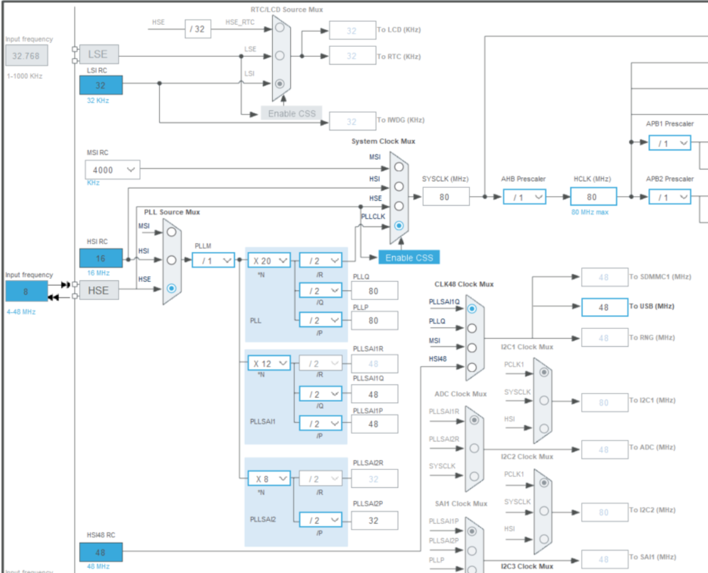
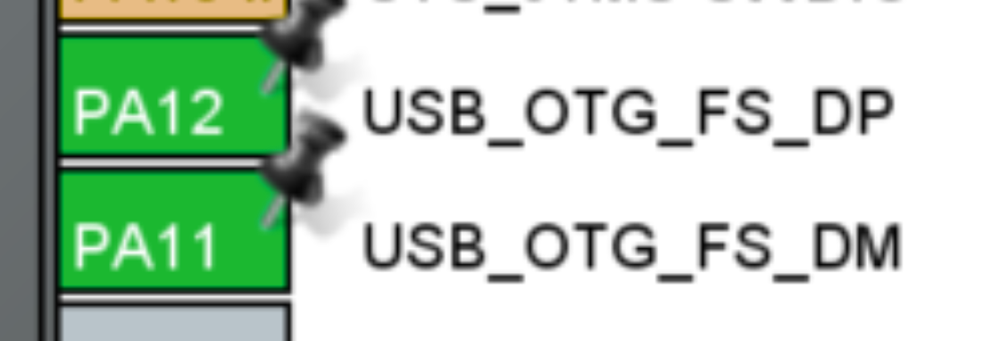

# OAE Serial Protocol

## Overview
A development framework has been designed for the DPOAE CliffBar prototype hardware, which uses an STMicroelectronics STM32 processor (STM32L496RGT6) . The framework is based on a serial packet protocol that can run over USB.

The development framework can be used to control and test various parts of the OAE embedded device from a host Python or other high level program. This can allow people of different backgrounds to use, evaluate, develop, and test the system without having detailed knowledge about all parts of the implementation.

The framework is extensible, so embedded developers can add their own features without disabling other existing features.

## Serial Protocol
The serial protocol is designed primarily as a command/response system initiated by the host, though debug, error, or event messages may be sent any time by the embedded device. 

The full list of commands and expected responses are shown below, but the major functions are:

* Start a specified command  
  * Developers can add their own test or functions  
* Stop a command  
* Upload a data buffer from host to embedded device  
* Download a data buffer from embedded device to host  
* Query status such as how long a particular function takes to run

### Data Buffers
Buffers of up to size 4096 can be passed between the host and the embedded device. Three data types are currently supported: 

* 24 bit unsigned integer (typically for audio data samples)  
* 32 bit signed integer (typically for debug data)  
* 32 bit floating point (for FFT and other processed data)

### OAE Serial Packet Format
* Byte 0: Header: 0x7E  
* Byte 1: Command  
* Byte 2: Payload\_size  
* Bytes 3 to Payload\_size \+ 3: Payload  
* Byte N: checksum (sum of all bytes, truncated to 8 bits)

### Host Commands
*  *CMD\_NOP* 			\= 0,		  
  * No payload, no response expected  
*  *CMD\_PING* 			\= 1,		  
  * Ping, no payload, RSP\_PING response expected  
* *CMD\_STATUS* 			\= 2,		  
  * Request status from OAE, no payload, multiple RSP\_TEXT responses expected  
* *CMD\_BUF\_REQ* 		\= 3,		  
  * Payload: 1 byte: U8, Request buffer \# from OAE  
* *CMD\_BUF\_START* 		\= 4,		  
  * Payload: byte 0: BufferDataType\_t, bytes 1 to N: buffer data. First packet of the buffer. RSP\_ACK or RSP\_ERR response expected  
* *CMD\_BUF* 			\= 5,		  
  * Payload: byte 0: BufferDataType\_t, bytes 1 to N: buffer data. No response expected (there will be 62 of these packets in a 4096 sample buffer)  
* *CMD\_BUF\_END* 		\= 6,		  
  * Payload: byte 0: BufferDataType\_t, bytes 1 to N: buffer data. Last packet of the buffer. RSP\_ACK or RSP\_ERR response expected  
* *CMD\_I2C\_RD*		 	\= 7,		  
  * Payload: 2 bytes: U8 I2C device address, U8 I2C register address, RSP\_U8 response expected (I2C read data)  
* *CMD\_I2C\_WR*			\= 8,		  
  * Payload: 3 bytes: U8 I2C device address, U8 I2C register address, U8 I2C write data, RSP\_ACK or RSP\_ERR response expected  
* *CMD\_START*			\= 9, 		  
  * Payload: 1 byte: U8, which command to start, RSP\_ACK or RSP\_ERR response expected  
* *CMD\_STOP*			\= 10,		  
  * Payload: 1 byte: U8, which command to stop, RSP\_ACK or RSP\_ERR response expected  
* *CMD\_OK* 			\= 11,		  
  * No payload

### OAE Embedded Device Responses
* *RSP\_PING* 			\= 101,		  
  * Ping response, no payload  
* *RSP\_ACK* 			\= 102,		  
  * No payload  
* *RSP\_NAK* 			\= 103,		  
  * No payload  
* *RSP\_ERR* 			\= 104,		  
  * Payload: Up to 250 bytes, text string  
* *RSP\_TEXT* 			\= 105,		  
  * Payload: Up to 250 bytes, text string  
* *RSP\_BUF\_START* 		\= 106,		  
  * Payload: byte 0: BufferDataType\_t, bytes 1 to N: buffer data. First packet of the buffer  
* *RSP\_BUF* 			\= 107,		  
  * Payload: byte 0: BufferDataType\_t, bytes 1 to N: buffer data.  
* *RSP\_BUF\_END*		\= 108,		  
  * Payload: byte 0: BufferDataType\_t, bytes 1 to N: buffer data. Last packet of the buffer  
* *RSP\_U8* 			\= 109,		  
  * Payload: 1 byte:  U8  
* *RSP\_U32* 			\= 110,		  
  * Payload: 4 bytes: U32  
* *RSP\_EVENT*			\= 111,		  
  * Payload: 1 byte:  U8 (event number)  
* *RSP\_INVALID* 			\= 112,		  
  * No payload (Command from host was not recognized)

### Extending the Development Framework
The framework is intended as a starting point for further development. Start and Stop commands have an 8 bit payload that indicates what action to take. Only one action is currently defined but it is easy to extend this:  
// Action commands:  
**typedef** **enum** {  
    *ACTION\_NONE* 	\= 0,  
  *ACTION\_OAE\_TEST* 	\= 1,  
} ActionCommand\_t;

Other serial commands and responses can be added in a similar manner.

## Host Python Test Application
A test application named oae\_serial\_host.py has been written to test and debug the OAE serial interface. This is checked into the oae\_firmware git repository (USB\_serial branch) in the tools directory.

Oae\_serial\_host.py can be run from the command line or instantiated as a class from another Python program. All testing to date has been done via the command line so some further development and debugging may be required if using this as a Python class.

The command line interface has one input argument: the serial port name. In Windows, this is COM1, COM2, etc. In Linux, this is something like /dev/ttyUSB0, though it may be different on different machines. If no arguments are specified, the program will return a list of all valid serial ports (on Windows).

## Using CliffBar with the Python Test Application
\> cd oae\_firmware\\tools  
\> python ./oae\_serial\_host.py			(no arguments)  
OAE serial protocol version: v1.3  
        Usage: python \-m oae\_serial\_host \<COM Port\>  
        Log and adc data files are saved to the logs/ subdirectory.  
Available Serial Ports:  
\- COM7 (USB Serial Device (COM7)  
\> python ./oae\_serial\_host.py COM7  
OAE serial protocol version: v1.3  
        Opening log file: logs\\20250502\_084926.log  
Connected to COM7 at 921600 baud.  
threadSwitchTime: 0.001  
Menu:  
        1\)      CMD\_PING  
        2\)      CMD\_STATUS  
        3\)      CMD\_BUF Upload (host test pattern)  
        4\)      CMD\_BUF Request 0 (oae test pattern)  
        5\)      CMD\_BUF Request 1 (current oae buffer)  
        6\)      CMD\_START ACTION\_OAE\_TEST  
        7\)      CMD\_STOP  
        8\)      CMD\_I2C\_RD  
        9\)      CMD\_I2C\_WR  
        ? or h) Print this menu  
        q)      Quit

The menu shown above are the currently implemented test commands. These have been implemented to verify and debug the serial protocol and the responses are not currently very user friendly. The response from each command will show the round trip time in microseconds to send the command and receive the response.  Note that some commands will generate more than one response.

Example:  
6\)      CMD\_START ACTION\_OAE\_TEST   
send\_TxPacket: CMD\_START  
        RSP\_TEXT oae\_algorithm\_test: 5 17  
                RoundTripTime: 34539 usec PktRxTime:   
96.1618751 sec  
        RSP\_TEXT         times: 13 14 16 17 17  
                RoundTripTime: 35721 usec PktRxTime:   
96.163062 sec  
        RSP\_ACK no payload. RoundTripTime: 37318 usec   
PktRxTime: 96.1646587 sec  
Test command 6 will run the OAE algorithm one time on whatever data is currently in the S32\_Buffer. The serial responses show how long (in milliseconds) each sub function of the OAE algorithm takes to execute on the STM32 processor. In this case, the OAE algorithm took 17 msec to run, and 37.3 msec from when the host initiated the command to when the RSP\_ACK response was received.

Please see the oae\_algorithm\_test() function for details.

## USB CDC Configuration
The serial protocol runs over USB CDC (Communications Device Class), which creates a virtual serial port on the host system. The STM32CubeIDE development platform includes USB CDC middleware that implements this protocol. 

To configure USB CDC on STM32 devices:

* Open your STM32CubeIDE project,  
* Open the .ioc file. This will bring up a graphical tool to configure your STM32.  
* Click on the “Clock Configuration” tab  
  * The USB system must have a high quality 48 MHz clock.  
  * There are many valid ways to generate this clock  
  * The current system clocks are configured as follows: 
  * 
* Click on the “Pinout & Configuration” tab  
  * Configure the USB OTG pins on the device  
    *  
  * In the “Middleware and Software Packs” section, click on USB\_DEVICE  
    * Select the CDC Class for FS IP:  
    * ![][image3]  
* Save the .ioc file  
  * It will ask if you would like to generate code. Say YES.  
* Note that generated code will overwrite existing code in main.c and other files. It will not overwrite code that is in between the USER CODE sections, so all of your code should be added in these areas (or in separate .c and .h files).  
  *  /\* USER CODE BEGIN \*/  
  *  /\* USER CODE END \*/

### Sending and Receiving USB CDC data
The USB CDC user programming interface is located in the following files:

* USB\_DEVICE/App/usbd\_cdc\_if.c and .h

When the USB CDC middleware code is first generated, usbd\_cdc\_if will mostly contain empty template functions. It is up to the programmer to add higher level code to manage the transmitted and received USB serial data.

Here are a few examples that show how data can be managed in usbd\_cdc\_if:

* [https://github.com/LonelyWolf/stm32/blob/master/cube-usb-cdc/cdc/usbd\_cdc\_if.c](https://github.com/LonelyWolf/stm32/blob/master/cube-usb-cdc/cdc/usbd_cdc_if.c)  
* [https://nefastor.com/microcontrollers/stm32/usb/stm32cube-usb-device-library/communication-device-class/](https://nefastor.com/microcontrollers/stm32/usb/stm32cube-usb-device-library/communication-device-class/)  
  * This is a good tutorial but our implementation is simpler than this.

### Receiving USB data
The STM32 USB middleware calls the following function each time it has received data from the USB host:

* **static** int8\_t **CDC\_Receive\_FS**(uint8\_t\* Buf, uint32\_t \*Len)

The oae framework has implemented a ring buffer system to manage the incoming serial data. This data and related buffer management variables are contained in the following ‘c’ data structure defined in usbd\_cdc\_if.h:

* **struct** s\_RxBuffers USB\_RxBuffers;

The IsCommandDataReceived flag tells the application that new serial data is available. The host app polls for this flag. When it sees that the flag is set high, it processes the received data, then sets the flag low.

### Transmitting USB data
The user application must call the following function each time it wants to send data to the USB host:

* uint8\_t **CDC\_Transmit\_FS**(uint8\_t\* Buf, uint16\_t Len)

### Managing USB CDC parameters (such as baud rate)
The USB middleware will call the following function to get or set USB CDC parameters:

* **static** int8\_t **CDC\_Control\_FS**(uint8\_t cmd, uint8\_t\* pbuf, uint16\_t length)

The only parameter currently implemented in this function is LINE\_CODING. While USB CDC baud rates can be much higher than a UART, host system virtual serial ports (such as Windows) are typically still constrained to 921600 baud or less. I have set the baud rate to 921600\.

# OAE\_Serial Code Implementation
The serial framework has been developed and checked into the USB\_serial branch of the oae\_firmware git repository.

* [https://github.com/ADE-GlobalHealth/oae\_firmware/tree/USB\_serial](https://github.com/ADE-GlobalHealth/oae_firmware/tree/USB_serial)  
* The serial protocol has been implemented in the following files:  
  * OAE\_CliffBar/app/oae\_serial.c  
  * OAE\_CliffBar/app/oae\_serial.h

The oae\_serial system is initialized in app\_main by calling this function:

* oae\_serial\_init()

The serial framework operates by monitoring the USB port for incoming data and processing data once a complete packet has been received. This is implemented in app\_main.c in the app\_loop( ).

// Check for incoming USB serial packets:  
**while** (RX\_USB\_CDC\_Data(RxBuffer, \&RxBufferLen) \== 1\) {  
  **for** (**int** i \= 0; i \< RxBufferLen; i++) {  
  **if** (oae\_serial\_receive(RxBuffer\[i\])) {  
HAL\_GPIO\_WritePin(LD2\_GPIO\_Port,LD2\_Pin, *GPIO\_PIN\_SET*);  
  oae\_process\_rx\_packet();  
  HAL\_GPIO\_WritePin(LD2\_GPIO\_Port,LD2\_Pin, *GPIO\_PIN\_RESET*);  
  }  
  }  
}

An LED is turned on while a command is being processed. This provides a visual indication of how long commands take. The LED signal may also be monitored on an oscilloscope to measure precise timing.

### Receiving and Processing Commands
The oae\_serial\_receive() function builds valid packets out of incoming USB data. When a packet is available, the function returns true, otherwise it returns false.

The oae\_process\_rx\_packet() function processes valid packets and generates response packets to send back to the host.

Please review the oae\_serial.c and .h code for the implementation details.

### Sending Responses
The oae\_serial\_send() function builds a response packet and sends it to the host system. It takes in the specified command, payload, and payload size. 

This is a blocking function that will not return until the USB transmit data fifo is empty.  It may be necessary / desirable to create a nonblocking version of this function to minimize interference with real time OAE operation.

### Sending and Receiving Data Buffers
All data buffers sent between the host and OAE embedded system are stored in the SerialBuf data structure. This data structure holds 3 data buffers and the size of their contents:   
**typedef** **struct** {  
  uint32\_t 	U32\_Buffer\[SERIAL\_BUFFER\_MAX\_SIZE\];  
  int32\_t		S32\_Buffer\[SERIAL\_BUFFER\_MAX\_SIZE\];  
  **float**		F32\_Buffer\[SERIAL\_BUFFER\_MAX\_SIZE\];  
  uint32\_t 	U32\_BufSize;  
  uint32\_t	 	S32\_BufSize;  
  uint32\_t 	F32\_BufSize;  
} SerialBuffers\_t;  
Other parts of the OAE firmware can copy data in and out of these buffers as needed.  
While the buffers are all 32 bits long, the data held in them can be of a shorter length. The supported data types are:  
  *BUF\_TYPE\_U24*		\= 1,		// 24 bit unsigned int  
  *BUF\_TYPE\_S32*		\= 2,		// 32 bit signed int  
  *BUF\_TYPE\_F32*		\= 3		// 32 bit float

The serial packet protocol has a maximum payload size of 250 bytes. Data buffers can be up to 4096 \* 32 bits in size (currently). Thus many packets are required to send data buffers between the host and the embedded system. 

Example: Send a buffer of *BUF\_TYPE\_U24* from the embedded system to the host.

* Sending 4096 samples of 24 bit data requires 64 packets of 64 samples each.  
* The host sends a **CMD\_BUF\_REQ** to the OAE device.  
* The OAE device sends the first data packet with the **RSP\_BUF\_START** response.   
* The OAE device sends the next 62 data packets with the **RSP\_BUF** response.   
* The OAE device sends the final data packet with the **RSP\_BUF\_END** response. 

Having the START and END commands makes it easy for the receiving side to manage the data. 
