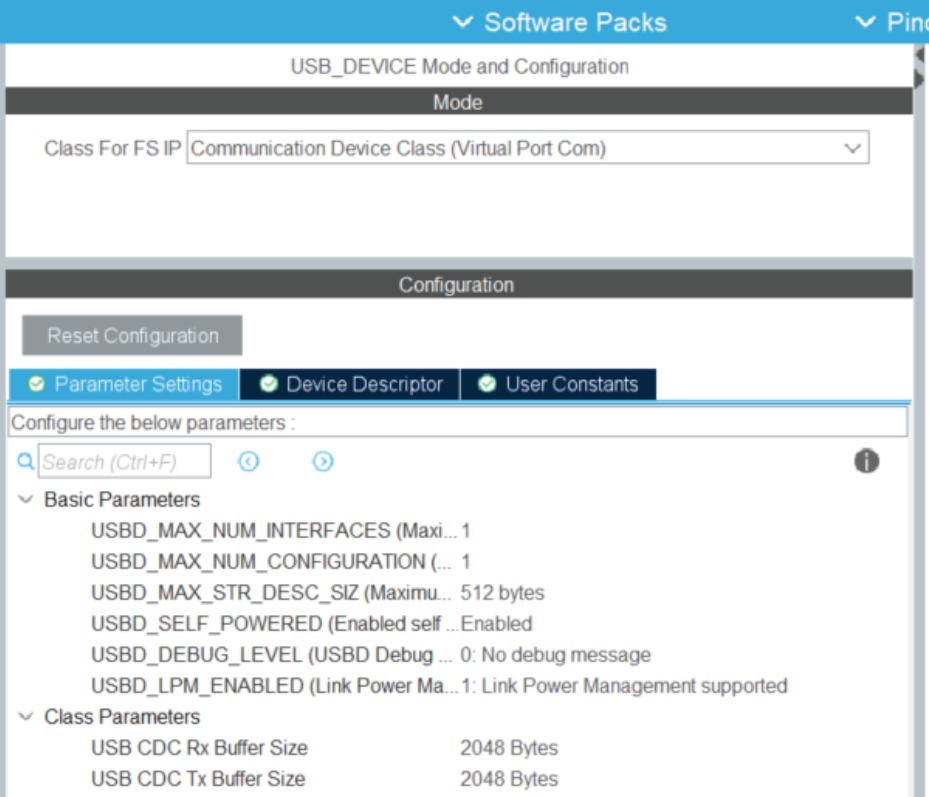

# OAE Serial Protocol
For steps on adding new commands and responses to the serial protocol, jump to **Extending the Development Framework**

## Overview
A development framework has been designed for the DPOAE CliffBar prototype hardware, which uses an STMicroelectronics STM32 processor (STM32L496RGT6) . The framework is based on a serial packet protocol that can run over USB.

The development framework can be used to control and test various parts of the OAE embedded device from a host Python or other high level program. This can allow people of different backgrounds to use, evaluate, develop, and test the system without having detailed knowledge about all parts of the implementation.

The framework is extensible, so embedded developers can add their own features without disabling other existing features.

## Serial Protocol
The serial protocol is designed primarily as a command/response system initiated by the host, though logging messages may be sent any time by the embedded device. 

The full list of commands and expected responses are shown below, but the major functions are:

* Start a specified command  
  * Developers can add their own test or functions  
* Stop a command  
* Upload a data buffer from host to embedded device  
* Download a data buffer from embedded device to host  
* Query status such as how long a particular function takes to run

### Data Buffers
Buffers of up to size 4096 can be passed between the host and the embedded device. Three data types are currently supported: 

* 24 bit unsigned integer (typically for audio data samples)  
* 32 bit signed integer (typically for debug data)  
* 32 bit floating point (for FFT and other processed data)

### OAE Serial Packet Format
* Byte 0: Header: 0x7E  
* Byte 1: Command  
* Byte 2: Payload\_size  
* Bytes 3 to Payload\_size \+ 3: Payload  
* Byte N: checksum (sum of all bytes, truncated to 8 bits)

### Host Commands
See `PacketCommand_t` in `oae_serial.h`.

### OAE Embedded Device Responses
See `PacketResponse_t` in `oae_serial.h`.

### Extending the Development Framework
Adding a new command to the OAE serial protocol requires changing three files: oae_serial.h, oae_serial.c, and oae_serial_host.py.

#### 1. oae_serial.h

Add the command to the `PacketCommand_t` enum. 
```
typedef enum {
 CMD_NOP       = 0,  
 CMD_RESET     = 1,   
 CMD_PING      = 2,  
 CMD_STATUS    = 3,    
 CMD_BUF_REQ   = 4,    
 CMD_BUF_START = 5,   
 CMD_BUF       = 6,   
 CMD_BUF_END   = 7,  
 CMD_I2C_RD    = 8,    
 CMD_I2C_WR    = 9,   
 CMD_STOP      = 10,  
 CMD_OK        = 11,
 CMD_OAE_TEST  = 12,
} PacketCommand_t;
```

If a specific response is needed, add it to the `PacketResponse_t` enum.

```
typedef enum  {
 RSP_HEARTBEAT    = 0,   
 RSP_PING         = 1,    
 RSP_ACK          = 2,  
 RSP_NAK          = 3,   
 RSP_ERR          = 4,   
 RSP_TEXT         = 5,  
 RSP_BUF_START    = 6,   
 RSP_BUF          = 7,    
 RSP_BUF_END      = 8,   
 RSP_U8           = 9,   
 RSP_U32          = 10, 
 RSP_EVENT        = 11,   
 RSP_INVALID      = 12,   
 RSP_LOG_DEBUG    = 13,   
 RSP_LOG_INFO     = 14,
 RSP_LOG_WARNING  = 15,
 RSP_LOG_ERROR    = 16,
 RSP_LOG_CRITICAL = 17,
} PacketResponse_t;
```

#### 2. oae_serial.c
In `oae_process_rx_packet()`, add a case statement for the target command. `CMD_PING` is shown as an example below. This is where the target command calls the intended functionality. To keep things clean, a call to a function defined elsewhere is best.

```
case CMD_PING:
      ULOG_DEBUG("Running CMD_PING");
      oae_serial_enqueue(RSP_PING, 0, (uint8_t *)TxBuffer);
      break; 
```

#### 3. oae_serial_host.py
Add the target command to the `Command` class:
```
class Command(IntEnum):
   """
   Host commands.

   Host commands flow from the host computer to the OAE embedded device.
   """

   def __str__(self):
       return "CMD_" + self.name

   NOP = 0 
   RESET = 1 
   PING = 2 
   STATUS = 3  
   BUF_REQ = 4 
   BUF_START = 5  
   BUF = 6 
   BUF_END = 7
   I2C_RD = 8 
   I2C_WR = 9 
   STOP = 10 
   OAE_TEST = 12
```

If a custom is required, add it to the `Response` class:
```
class Response(IntEnum):
   """
   OAE device responses.

   Responses flow from the OAE device to the host computer.
   """

   def __str__(self):
       return "RSP_" + self.name

   HEARTBEAT = 0 
   PING = 1  
   ACK = 2
   NAK = 3 
   ERR = 4  
   TEXT = 5 
   BUF_START = 6 
   BUF = 7  
   BUF_END = 8  
   U8 = 9  
   U32 = 10 
   EVENT = 11
   INVALID = 12
   LOG_DEBUG = 13
   LOG_INFO = 14
   LOG_WARNING = 15
   LOG_ERROR = 16
   LOG_CRITICAL = 17
```

Add the target command to the menu:
```
def print_menu(self):
       print("# Menu: ")
       print("# \t0) \tCMD_RESET ")
       print("# \t1) \tCMD_PING ")
       print("# \t2) \tCMD_STATUS ")
       print("# \t3) \tCMD_BUF Upload (host test pattern)")
       print("# \t4) \tCMD_BUF Request 0 (oae test pattern)")
       print("# \t5) \tCMD_BUF Request 1 (current oae buffer)")
       print("# \t6) \tCMD_STOP ")
       print("# \t7) \tCMD_I2C_RD ")
       print("# \t8) \tCMD_I2C_WR ")
       print("# \t? or h) Print this menu")
       print("# \tq) \tQuit")
```       

Add the command to `serial_user_interface()`. `CMD_PING` is show as an example:
```
elif user_input[0] == "1":
               self.command_response(Command.PING)
```              

If a custom response was added and custom functionality should trigger on receipt, add it to `process_rx_response()`.

## Host Python Test Application
A test application named `oae_serial_host.py` has been written to test and debug the OAE serial interface. This is available in `tools/oae_serial/`.

`oae_serial_host.py` can be run from the command line or instantiated as a class from another Python program. All testing to date has been done via the command line so some further development and debugging may be required if using this as a Python class.

The command line interface has one input argument: the serial port name. In Windows, this is COM1, COM2, etc. In Linux, this is something like /dev/ttyUSB0, though it may be different on different machines. If no arguments are specified, the program will attempt to connect to the OAE device based on a default name, otherwise a list of available ports will be listed.

## Using CliffBar with the Python Test Application
```
> uv run oae_serial_host
2025-11-30 16:59:45 host   INFO     oae_serial_host.py:175 - Initializing serial port
2025-11-30 16:59:45 host   INFO     oae_serial_host.py:181 - Connected to /dev/ttyACM0 at 921600 baud
2025-11-30 16:59:45 host   DEBUG    oae_serial_host.py:194 - threadSwitchTime: 0.001
2025-11-30 16:59:45 host   INFO     oae_serial_host.py:529 - Resetting device
2025-11-30 16:59:45 host   DEBUG    oae_serial_host.py:410 - send_TxPacket: CMD_RESET
2025-11-30 16:59:45 host   INFO     oae_serial_host.py:535 - Closing serial port
2025-11-30 16:59:46 host   INFO     oae_serial_host.py:175 - Initializing serial port
2025-11-30 16:59:46 host   INFO     oae_serial_host.py:181 - Connected to /dev/ttyACM0 at 921600 baud
2025-11-30 16:59:46 host   DEBUG    oae_serial_host.py:194 - threadSwitchTime: 0.001
# Menu: 
#       0)      CMD_RESET 
#       1)      CMD_PING 
#       2)      CMD_STATUS 
#       3)      CMD_BUF Upload (host test pattern)
#       4)      CMD_BUF Request 0 (oae test pattern)
#       5)      CMD_BUF Request 1 (current oae buffer)
#       6)      CMD_STOP 
#       7)      CMD_I2C_RD 
#       8)      CMD_I2C_WR 
#       ? or h) Print this menu
#       q)      Quit
```

The menu shown above are the currently implemented test commands. These have been implemented to verify and debug the serial protocol and the responses are not currently very user friendly. The response from each command will show the round trip time in milliseconds to send the command and receive the response.  Note that some commands will generate more than one response.

## Logging
Messages from the host program and the device are logged using Python's built-in logging module. Logs from the device are sent over USB and [ulog](https://github.com/rdpoor/ulog?tab=MIT-1-ov-file#readme) is used to facilitate string formatting and log levels.

For adding host log messages, consult Python documentation, for adding device lost messages consult ulog documentation.

## USB CDC Configuration
The serial protocol runs over USB CDC (Communications Device Class), which creates a virtual serial port on the host system. The STM32CubeIDE development platform includes USB CDC middleware that implements this protocol. 

To configure USB CDC on STM32 devices:

* Open your STM32CubeIDE project,  
* Open the .ioc file. This will bring up a graphical tool to configure your STM32.  
* Click on the “Clock Configuration” tab  
  * The USB system must have a high quality 48 MHz clock.  
  * There are many valid ways to generate this clock  
  * The current system clocks are configured as follows: 
  * 
* Click on the “Pinout & Configuration” tab  
  * Configure the USB OTG pins on the device  
    *  
  * In the “Middleware and Software Packs” section, click on USB\_DEVICE  
    * Select the CDC Class for FS IP:  
    *  
* Save the .ioc file  
  * It will ask if you would like to generate code. Say YES.  
* Note that generated code will overwrite existing code in main.c and other files. It will not overwrite code that is in between the USER CODE sections, so all of your code should be added in these areas (or in separate .c and .h files).  
  *  /\* USER CODE BEGIN \*/  
  *  /\* USER CODE END \*/

### Sending and Receiving USB CDC data
The USB CDC user programming interface is located in the following files:

* USB\_DEVICE/App/usbd\_cdc\_if.c and .h

When the USB CDC middleware code is first generated, usbd\_cdc\_if will mostly contain empty template functions. It is up to the programmer to add higher level code to manage the transmitted and received USB serial data.

Here are a few examples that show how data can be managed in usbd\_cdc\_if:

* [https://github.com/LonelyWolf/stm32/blob/master/cube-usb-cdc/cdc/usbd\_cdc\_if.c](https://github.com/LonelyWolf/stm32/blob/master/cube-usb-cdc/cdc/usbd_cdc_if.c)  
* [https://nefastor.com/microcontrollers/stm32/usb/stm32cube-usb-device-library/communication-device-class/](https://nefastor.com/microcontrollers/stm32/usb/stm32cube-usb-device-library/communication-device-class/)  
  * This is a good tutorial but our implementation is simpler than this.

### Receiving USB data
The STM32 USB middleware calls the following function each time it has received data from the USB host:

* **static** int8\_t **CDC\_Receive\_FS**(uint8\_t\* Buf, uint32\_t \*Len)


The oae framework has implemented a ring buffer system to manage the incoming serial data. This data and related buffer management variables are contained in the following ‘c’ data structure defined in usbd\_cdc\_if.h:

* **struct** s\_RxBuffers USB\_RxBuffers;

The IsCommandDataReceived flag tells the application that new serial data is available. The host app polls for this flag. When it sees that the flag is set high, it processes the received data, then sets the flag low.

### Transmitting USB data
The user application must call the following function each time it wants to send data to the USB host:

* uint8\_t **CDC\_Transmit\_FS**(uint8\_t\* Buf, uint16\_t Len)

### Managing USB CDC parameters (such as baud rate)
The USB middleware will call the following function to get or set USB CDC parameters:

* **static** int8\_t **CDC\_Control\_FS**(uint8\_t cmd, uint8\_t\* pbuf, uint16\_t length)

The only parameter currently implemented in this function is LINE\_CODING. While USB CDC baud rates can be much higher than a UART, host system virtual serial ports (such as Windows) are typically still constrained to 921600 baud or less. I have set the baud rate to 921600\.

# OAE\_Serial Code Implementation

The serial protocol has been implemented in the following files:  
  * `OAE_CliffBar/app/oae_serial.c`  
  * `OAE_CliffBar/app/oae_serial.h`

The oae\_serial system is initialized in app\_main by calling this function:

* `oae_serial_init()`

The serial framework operates by monitoring the USB port for incoming data and processing data once a complete packet has been received. This is implemented in app\_main.c in the app\_loop( ).

```
// Check for incoming USB serial packets:
while (RX_USB_CDC_Data(RxBuffer, &RxBufferLen) == 1) {
  for (int i = 0; i < RxBufferLen; i++) {
  if (oae_serial_receive(RxBuffer[i])) {
HAL_GPIO_WritePin(LD2_GPIO_Port,LD2_Pin, GPIO_PIN_SET);
	oae_process_rx_packet();
	HAL_GPIO_WritePin(LD2_GPIO_Port,LD2_Pin, GPIO_PIN_RESET);
  }
  }
}
```

An LED is turned on while a command is being processed. This provides a visual indication of how long commands take. The LED signal may also be monitored on an oscilloscope to measure precise timing.

### Receiving and Processing Commands
The `oae_serial_receive()` function builds valid packets out of incoming USB data. When a packet is available, the function returns true, otherwise it returns false.

The `oae_process_rx_packet()` function processes valid packets and generates response packets to send back to the host.

Please review the `oae_serial.c` and `.h` code for the implementation details.

### Sending Responses
Responses from the device can be send as blocking or non-blocking. Responses such as those for sending a buffer should be send as non-blocking so that no responses are lost. Less critical messages, or those sent even when the device is disconnected from USB should be sent as non-blocking to prevent blocking execution without an active USB connection.

### Sending and Receiving Data Buffers
All data buffers sent between the host and OAE embedded system are stored in the SerialBuf data structure. This data structure holds 3 data buffers and the size of their contents:   
```
typedef struct {
	uint32_t 	U32_Buffer[SERIAL_BUFFER_MAX_SIZE];
	int32_t		S32_Buffer[SERIAL_BUFFER_MAX_SIZE];
	float		F32_Buffer[SERIAL_BUFFER_MAX_SIZE];
	uint32_t 	U32_BufSize;
	uint32_t	 	S32_BufSize;
	uint32_t 	F32_BufSize;
} SerialBuffers_t;
```

Other parts of the OAE firmware can copy data in and out of these buffers as needed.  
While the buffers are all 32 bits long, the data held in them can be of a shorter length. The supported data types are:  
```
BUF_TYPE_U24		= 1,		// 24 bit unsigned int
BUF_TYPE_S32		= 2,		// 32 bit signed int
BUF_TYPE_F32		= 3		// 32 bit float
```

The serial packet protocol has a maximum payload size of 250 bytes. Data buffers can be up to 4096 \* 32 bits in size (currently). Thus many packets are required to send data buffers between the host and the embedded system. 

Example: Send a buffer of *BUF\_TYPE\_U24* from the embedded system to the host.

* Sending 4096 samples of 24 bit data requires 64 packets of 64 samples each.  
* The host sends a **CMD\_BUF\_REQ** to the OAE device.  
* The OAE device sends the first data packet with the **RSP\_BUF\_START** response.   
* The OAE device sends the next 62 data packets with the **RSP\_BUF** response.   
* The OAE device sends the final data packet with the **RSP\_BUF\_END** response. 

Having the START and END commands makes it easy for the receiving side to manage the data. 
